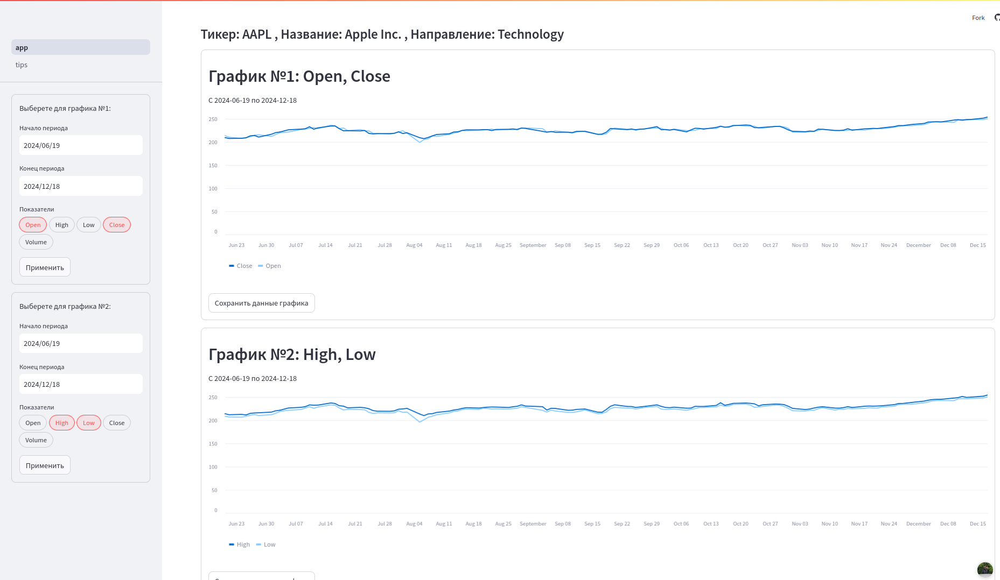
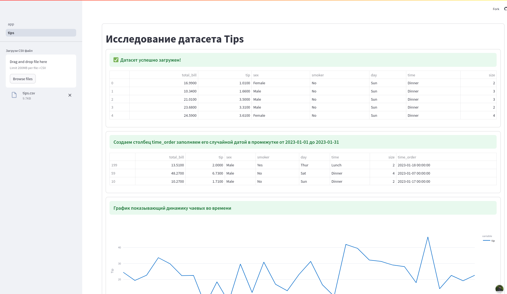

# Streamlit App
___
[Готовой приложение на сайте Strteamlit](https://rstflght-streamlit-app-app-merxmg.streamlit.app/) 

* app.py - Основная страница приложения
* requirements.txt - Необходимые для работы пакеты
* папка pages содержит дополнительную страницу tips.py - исследование датасета tips.csv
* tist.csv - датасет
* Dockerfile - иструкции для контейнеризации приложения в Docker
  ___
* Cборка образа Docker: ```docker build -t streamlit_app:1 .```
* Запуск образа: ```docker run --rm -d streamlit_app:1 ```
___
Пример основной страницы с котировка Apple

Пример страницы исследование датасета tips.csv

